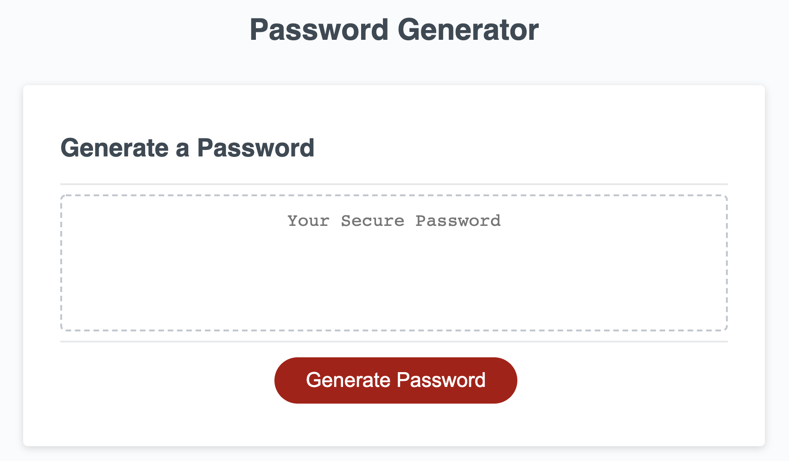
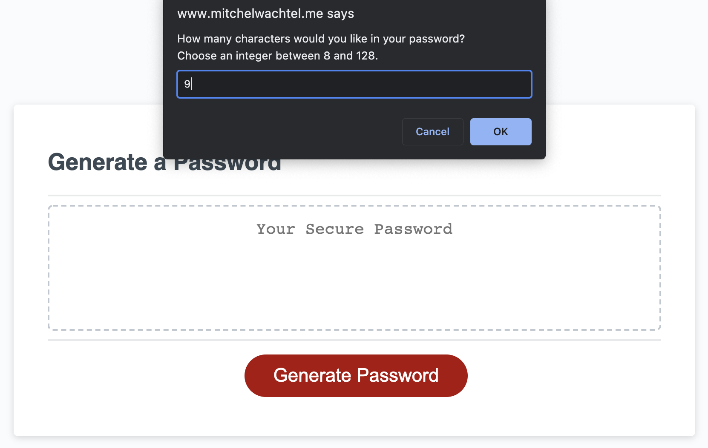
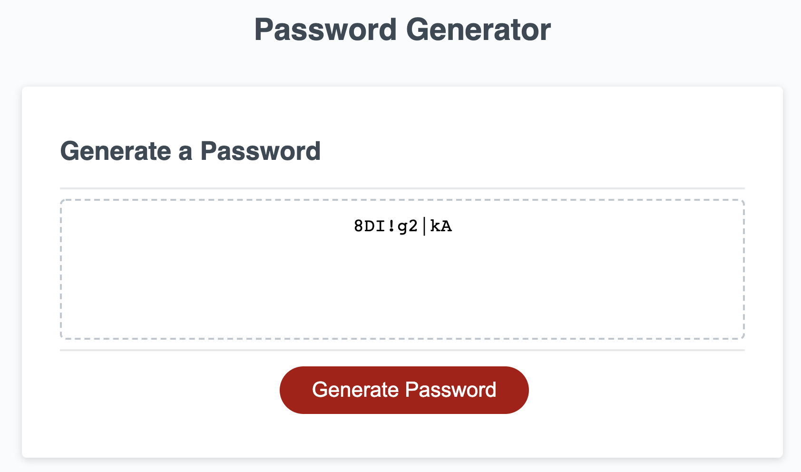

# Password Generator

## Mitchel Wachtel - mitchel.wachtel@gmail.com

---
## Description

Technologies used: Javascript with HTML & CSS. GitHub pages was used in order to publish the site.

My main motivation was to practice my use of javascript logic. Having to embed functions in functions, use prompts, if statements, loops, and array operations all at the same time was a challenge I was really excited for. I really enjoy building things: Decks, gardens, tables, etc. I love the feeling of accomplishment when I have successfully built something practical. I have learned that I get that same feeling from completing these coding projects. Each new skill in javascript, html, and css that I have learned feels like a new power tool. My mind is trying to keep up with the possibilities. This project brought me great joy.

I learned that you can break (end) a function with return. I learned fundamentally the importance of scope of variables: I had originally put the password variable on the global scope, so my original function was concating new passwords right behind previous ones. I learned how powerful the Math.random() function is and I feel like I'm getting more confortable in using it well. I learned about the Fisher and Yates Method for scrambling, this process that I read about on Stack Overflow and Wikipedia helped me to think through the logic I needed to write.

This browser app generates a completely random password based on your preferences. It will ask how many characters you would like in the password and which character types you would like. All character types selected will be included in your password.

Next steps: style the page with CSS, give it a more exciting CSS theme.

---

### **Deployed Site** can be found *[here](https://www.mitchelwachtel.me/password-generator)*. 

---

### **GitHub Repository** can be found *[here](https://github.com/mitchelwachtel/password-generator)*.

---
## Installation 

Simply open in a brower and the webpage should appear as below.

---
## Credits

I learned from *[this thread](https://stackoverflow.com/questions/2450954/how-to-randomize-shuffle-a-javascript-array)* on Stack Overflow and on *[wikipedia](https://en.wikipedia.org/wiki/Fisher%E2%80%93Yates_shuffle#The_modern_algorithm)* about the Fisher and Yates method of scrambling items of an array. This was crucial for me to make sure that the final password was truly scrambled. 

---
## License

GNU General Public License v3.0